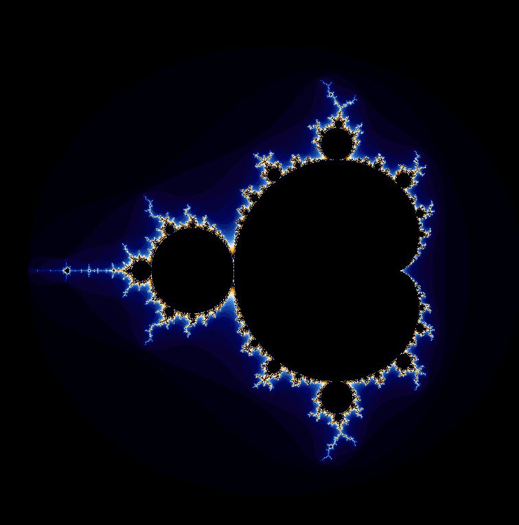

# Mandelbrot Set
This is a project to help understand multi-threads. The mandelbrot set is calculated in parallel via pthread and printed using OpenGL. Multi-threads significantly increase performance to calculate mandelbrot sets. It depends on the number of physical threads your processor has.

Dependencies
--------------------------------------
```sudo apt-get install libglu1-mesa-dev freeglut3-dev mesa-common-dev```<br>
```sudo apt-get install mesa-utils libgl1-mesa-glx```
<br>

Run
--------------------------------------
```make```<br>
```./mandelbrot {# of threads}```

Environment
--------------------------------------
core : Intel(R) Core(TM) i7-8565U CPU, 4 cores, 8 threads
OS : Ubuntu 20.04


Result
--------------------------------------

 </img><br><br><br><br>


 

 

 

 

 

 

 

 

 

 

 

 

 

 

 

 

 

 

 

 

 

 

 

 

 

 

 

 

 
